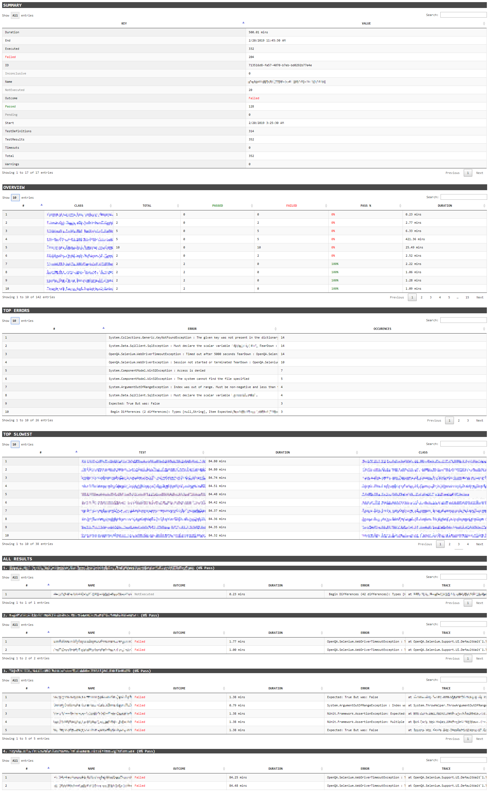

# `repor[t]rx`

> TRX to HTML Report

#### FEATURES
- Test Execution Summary
- Top Errors (with counts)
- Top Slowest (with duration)
- High-level Overview of results by individual Class
- Detailed-results grouped by individual Class
- [Sort / Search / Paging](https://datatables.net)
- `Hover / Mouse-over` to expand cell-contents (useful for chunky errors / stack-traces)

#### USAGE
`reportrx.exe "path-to-trx-file-or-folder"`

